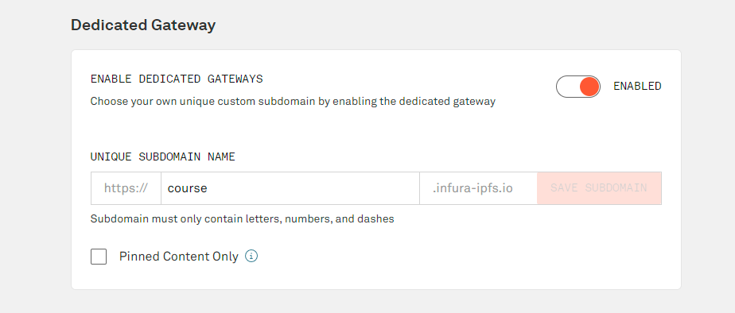

### pre-requisites

- nodejs
- truffle
- ganache-cli/ganache-gui
- metamask
- Infura account for IPFS service

### ganache

- make sure you have `ganache-cli` or `ganache-gui` running on port 8545 and network id 5777
- if you want to use a different port/different work id, you will need to update the `truffle-config.js` file in directory `smart-contracts` and `.env` file in directory `fe`
  `
- choose 'MERGE' for 'HARDFORK' options in ganache settings

### metamask

- make sure you have metamask installed and connected to the ganache network
- import some accounts from ganache into metamask

### infura

- go to [infura](https://infura.io/)
- create an infura account
- you may need to bind a credit card to use the service but you will not be charged in the free tier
- create a new api key
- copy the api key and api private key and paste them into the `.env` file

### deploy the smart contracts

- `cd` into the `smart-contracts` directory
- run `truffle migrate` and wait for the contracts to be deployed on the ganache network
- you will see contract artifact files in the `fe/src/artifacts` directory after the migration is complete
- copy the two contract addresses from the terminal and paste them into the `.env` file
- you should set a dedicated gateway with a custom subdomain like below
  
- copy the gateway url and paste it into the `.env` file
  the format is like: `https://xxx.infura-ipfs.io/ipfs`

## install frontend dependencies

- `cd` into the `fe` directory
- run `npm install` to install the dependencies

## start the app

- `cd` into the `fe` directory`
- run `npm start` to start the app
- the app should open in your browser at `http://localhost:3000`
